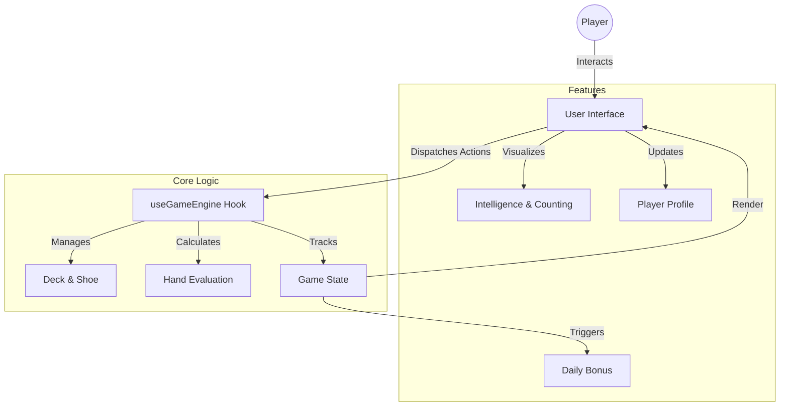

# 🃏 Blackjack Pro 21

> **The Ultimate Modern Web Blackjack Experience.**  
> *Master the game with advanced training tools, real-time analytics, and a premium casino atmosphere.*


---

## ✨ Features at a Glance

### 🎮 **Core Gameplay**
- **Classic Rules**: Authentic Blackjack experience with Hit, Stand, Double Down, Split, and Insurance.
- **Fair Dealing**: Cryptographically secure shuffling and deck management.
- **Smart Dealer**: Implements standard casino dealer logic (Stand on Hard 17).

### 🧠 **Intelligence & Training Suite**
- **Trainer Mode**: Toggle on "Pro Mode" to see real-time **Running Count (RC)** and **True Count (TC)**.
- **Strategy Feedback**: Instant visual cues when you make a statistically suboptimal move.
- **Strategy Heatmap**: Visualize your play patterns and improve your win rate over time.

### 💰 **Player Progression**
- **Daily Bonuses**: Return every day for chip rewards to keep the stakes high.
- **Betting History**: Detailed tracking of your wins, losses, and pushes.
- **Player Profile**: Persistent stats tracking (Bankroll, Max Win, Hands Played).

### 🎨 **Premium Visuals**
- **Glassmorphism UI**: A sleek, modern aesthetic with translucent layers by **Tailwind CSS**.
- **Fluid Animations**: Smooth card dealing and chip movements powered by **Framer Motion**.
- **Responsive Design**: Flawless experience across Desktop, Tablet, and Mobile devices.

---

## 🛠️ Architecture



---

## 🚀 Getting Started

### Prerequisites
- Node.js (v18+)
- npm or yarn

### Installation

1.  **Clone the Repository**
    ```bash
    git clone https://github.com/yourusername/blackjack-pro-21.git
    cd blackjack-pro-21
    ```

2.  **Install Dependencies**
    ```bash
    npm install
    ```

3.  **Start the Experience**
    ```bash
    npm run dev
    ```
    Open your browser to `http://localhost:5173`.

---

## 🏗️ Tech Stack

| Category | Technology | Usage |
|----------|------------|-------|
| **Frontend** | React 19 | Component Architecture |
| **Bundler** | Vite | Lightning-fast HMR & Build |
| **Styling** | Tailwind CSS | Utility-first Design System |
| **Animations** | Framer Motion | Gestures and Transitions |
| **Icons** | Lucide React | Crisp, SVG-based Iconography |
| **State** | React Context + Hooks | Global Game State Management |

---

## 🔮 Roadmap

- [ ] Online Multiplayer Mode
- [ ] Global Leaderboards
- [ ] Multiple Table Themes
- [ ] Voice Control Integration

---

## 📄 License

Distributed under the MIT License. See `LICENSE` for more information.
